<!-- hero: the extruded 3d ascii wordmark (wipes in left-to-right, then rocks on
     its vertical axis), with the monochrome ascii portrait (types in) below it.
     wordmark: python scripts/make_wordmark_svg.py --mode rock
     portrait: python scripts/prep_photo.py <your-photo> && python scripts/make_ascii_svg.py
     how the wordmark is built: docs/3d-ascii-wordmark.md -->

<h3><code>krrish@github ~ $ whoami</code></h3>

 
 

<h3><code>krrish@github ~ $ ./portrait.sh</code></h3>

 
 

<!-- animated contribution graph: real data, boxes reveal cell by cell
     (regenerated daily by .github/workflows/update-profile-art.yml) -->

<h3><code>krrish@github ~ $ ./contributions.sh</code></h3>

 
 

<h3><code>krrish@github ~ $ ./links.sh</code></h3>

<b>Final-Year CS Student · Java · C++ · Python · DSA</b>

 

